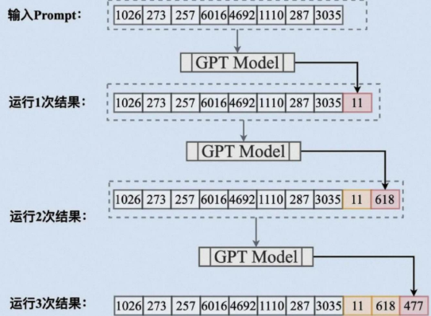

# 目录

1. [Prompt基础知识介绍](#prompt基础知识介绍)
2. [编写有效Prompt的原则和技巧](#编写有效prompt的原则和技巧)
3. [现场演示](#现场演示)
4. [总结和展望](#总结和展望)

---

## Prompt基础知识介绍
Prompt（提示词）是指在与人工智能模型（如大语言模型）交互时，用户输入的指令、问题或描述。通过设计不同的Prompt，可以引导模型生成所需的内容或完成特定任务。Prompt的质量直接影响模型输出的准确性和实用性。

例如，向AI提出“请写一篇关于人工智能发展的文章”就是一个Prompt。好的Prompt能够明确表达需求，减少歧义，提高生成结果的相关性和质量。

## 编写有效Prompt的原则和技巧

为什么要去了解**Prompt**呢？原因在于**大模型**在处理Prompt时，会将输入的文本（即Prompt）转换成一系列的**词向量**（[什么是词向量？](https://zh.wikipedia.org/wiki/%E8%AF%8D%E5%90%91%E9%87%8F)）。然后，模型通过**自回归生成过程**（[自回归模型解释](https://blog.csdn.net/m0_63855028/article/details/146239674)）逐个生成回答中的词汇。在生成每一个词时，模型会基于输入的Prompt以及前面生成的所有词来进行预测。这个过程不断重复，直到模型生成完整的答案或者达到设定的最大长度。

**Prompt的创新意义**
- **交互性**：允许用户使用自然语言的模式与模型进行交互，降低了使用者的技术门槛。
- **灵活性**：通过不同的Prompt设计，同一个模型可以应用于多种不同的任务。
- **指导性**：良好的Prompt设计可以指导模型按照指导的规则进行返回，提高回答的准确性。

**编写Prompt的六大原则**

---

1. **明确指令**：避免模糊不清的指令，确保模型理解任务，以获得精准、符合期望的输出。
2. **提供参考内容**：通过提供参考文本，降低模型编造虚假信息的可能性，增强回答的可信度和准确性。
3. **任务分解**：将复杂任务拆分为多个简单的子任务，降低整体错误率，提高任务处理的效率和准确性。
4. **给予思考时间**：允许模型足够的思考时间，并要求展示推导过程，以提高结果的可信度和解释性。
5. **利用外部工具**：借助其他工具的输出补充模型的不足，结合外部资源优势，提高模型输出的准确性和全面性。
6. **系统性测试**：通过全面的系统性测试，对模型的性能进行量化评估和持续优化，确保模型在不同场景下表现稳定、可靠。

---

**编写Prompt流程图示意：**
TODO:后续完成六大原则的流程图绘制，生成markdown格式，以便实现xmind形式的输出。

## 现场演示

**案例分享**

## 总结和展望
Prompt: 为模型提供输入，用以引导AI模型生成特点的输出。
好的提示词，会有更好的效果，提示词工程还在路上，仍需努力！！！